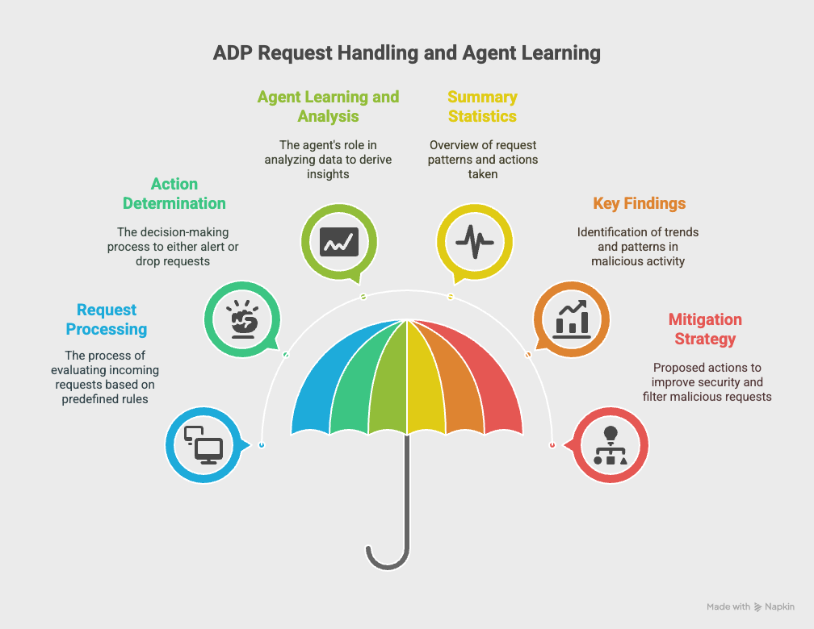

```markdown
```
---

# Analysis of ADP Request Handling and Agent Learning

This document provides an overview of the request handling process at the ADP (Application Data Processing) service, detailing how requests are processed based on defined rules and the subsequent learning and analysis performed by an agent. The focus is on the structure of the data collected, the actions taken (either ALERT or DROP), and the insights generated by the agent over time.


## Request Processing at ADP

Requests received at the ADP service are evaluated according to predefined rules associated with specific Signature IDs (SIDs). Each request is characterized by:

- **Source IP**: The IP address from which the request originates.
- **Source Port**: The port number used by the source.
- **Destination IP**: The fixed IP address of the destination server.
- **Destination Port**: The port number on which the destination server listens (in this case, port 53).

The data collected at ADP follows a specific format:

```
TIME <epoch time> %Y-%m-%d %H:%M:%S
SID src_ip src_port dest_IP dest_port Action hit_count domain_name
```

## Action Determination

Based on the rules defined at ADP, each request can result in one of two actions:

- **ALERT**: Indicates that the request has triggered a warning based on the defined rules.
- **DROP**: Indicates that the request has been blocked and will not be processed further.


It is important to note that multiple SIDs can appear within a specific time frame, each potentially resulting in different actions (DROP or ALERT).

## Agent Learning and Analysis

An agent is employed to learn from the data collected over time. This agent analyzes the incoming requests and their associated actions to derive meaningful statistics and insights. The agent's output includes:

### Summary Statistics

The agent compiles summary statistics that provide an overview of the request patterns, including:

- Total number of requests received.
- Breakdown of actions taken (number of ALERTs vs. number of DROPs).
- Frequency of requests from specific source IPs and ports.

### Key Findings

The agent identifies key findings from the data, which may include:

- Trends in malicious activity based on the frequency of ALERTs.
- Patterns in requests that lead to DROPs, indicating potential threats.
- Identification of specific domains that are frequently targeted.

### Mitigation Strategy

Based on the analysis, the agent proposes a mitigation strategy that may involve:

- Adjusting the rules at ADP to better filter out malicious requests.
- Implementing additional monitoring for specific source IPs or domains that show suspicious activity.
- Recommendations for further investigation into repeated ALERTs or DROPs associated with certain SIDs.

## Conclusion

The ADP service plays a critical role in managing incoming requests based on defined security rules. The agent's ability to learn from the collected data enhances the overall security posture by providing valuable insights and actionable strategies. Continuous monitoring and adaptation of the rules will ensure that the ADP remains effective in identifying and mitigating potential threats.

---


# How to Install and use the code

## Step 1: Checkout a New Branch
```bash
git checkout -b user/pmallick/hack-01
```

## Step 2: Set Up a Virtual Environment
```bash
python -m venv myenv
source myenv/bin/activate
```

## Step 3: Install Dependencies
1. **Check installed packages (should be empty):**
    ```bash
    pip freeze
    ```
2. **Install required packages:**
    ```bash
    pip install -r requirements.txt
    ```
3. **Verify installed packages:**
    ```bash
    pip freeze
    ```

## Step 4: Run the Application
Run the application in the terminal under the `myenv` development environment:
```bash
python app.py
```

You should see the following output:
```
 * Serving Flask app 'app'
 * Debug mode: on
WARNING: This is a development server. Do not use it in a production deployment. Use a production WSGI server instead.
 * Running on all addresses (0.0.0.0)
 * Running on http://127.0.0.1:5000
 * Running on http://<your machine IP>:5000
Press CTRL+C to quit
 * Restarting with stat
 * Debugger is active!
```

## Step 5: Access the Application
Open your web browser and navigate to:
- http://127.0.0.1:5000
- http://<your machine IP>:5000
```
```
